# Complete CI/CD & DevSecOps Pipeline

**Course:** DevOps  
**Topic:** End-to-End DevSecOps Pipeline, Automated Quality Gates, Static Application Security Testing (SAST), Software Composition Analysis (SCA), Secret Scanning, Container Image Scanning with Trivy, Container Registry Publishing, and Automated Kubernetes Deployment  
**Name:** Tanishq  
**Enrollment Number:** 24bcs10303  
**Standalone Project Repository:** https://github.com/Tanishq217/devops-pipeline  
**Main Course Repository:** https://github.com/Tanishq217/DevOps-Man  
**Environment:** macOS (Apple Silicon) / Python 3.12+ / Flask / Pytest / Docker / Trivy / Kind / Minikube / GitHub Actions  

---

## Executive Summary & Objectives

Traditional DevOps automates delivery velocity, but often treats security as an afterthought performed right before or after production deployment. **DevSecOps** infuses security practices, compliance policies, and automated vulnerability scanning directly into every phase of the continuous delivery pipeline—a paradigm known as **"Shift-Left Security"**.

This project implements an enterprise-grade, multi-stage **CI/CD + DevSecOps Pipeline** using **GitHub Actions**.

### Pipeline Stages & Quality Gates:
1. **Application Build & Unit Testing:** Pytest suite with code coverage tracking.
2. **SAST (Static Application Security Testing):** GitHub CodeQL semantic code analysis and Bandit Python AST security rules.
3. **SCA (Software Composition Analysis):** `pip-audit` scanning application dependencies against global CVE vulnerability advisories.
4. **Secret Scanning:** Automated repository scanning preventing hardcoded tokens, API keys, and unencrypted credentials.
5. **Container Packaging:** Security-hardened Docker container built with minimal attack surface and non-root execution.
6. **Container Image Scanning:** Aqua Security **Trivy** scanning image layers for CRITICAL and HIGH operating system and library vulnerabilities.
7. **Security Gate:** Automated gate blocking downstream delivery if critical vulnerabilities or exposed secrets exist.
8. **Container Registry Distribution:** Automated image tagging and publication to GitHub Container Registry (`ghcr.io`).
9. **Automated Kubernetes Deployment:** Ephemeral Kubernetes Kind cluster provisioning, manifest hydration with commit SHA, automated rollout verification, and in-cluster live HTTP smoke testing.

---

## DevSecOps Pipeline Architecture

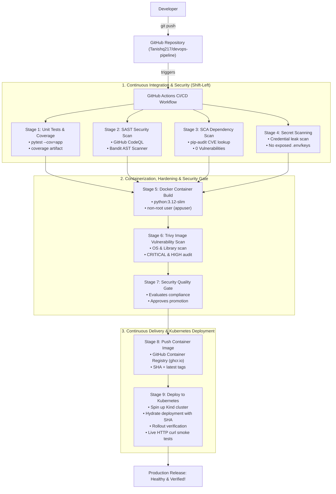

---

## Project Directory Layout

```text
devops-pipeline/
├── app/
│   ├── __init__.py
│   ├── app.py                     # Production Flask microservice & observability APIs
│   └── templates/
│       └── index.html             # Responsive DevSecOps status dashboard UI
├── tests/
│   ├── __init__.py
│   └── test_app.py                # Comprehensive Pytest suite covering all routes & edge cases
├── k8s/
│   ├── deployment.yaml            # Kubernetes Deployment with probes & resource constraints
│   └── service.yaml               # Kubernetes NodePort Service exposing application
├── .github/
│   └── workflows/
│       └── devsecops.yml          # Complete 9-stage DevSecOps GitHub Actions pipeline
├── Dockerfile                     # Hardened container image running as non-root user
├── requirements.txt               # Production dependencies (Flask)
├── requirements-dev.txt           # Test & security dependencies (pytest, pytest-cov, pip-audit, bandit)
├── pytest.ini                     # Pytest runner configuration
├── SECURITY.md                    # Vulnerability reporting & security policy
├── .gitignore                     # Git exclusion rules
├── screenshots/                   # Verification screenshots
└── README.md                      # Master technical documentation
```

---

## Security Tools Breakdown

| Security Layer | Tool | Operational Purpose in Pipeline | Failure Condition |
|---|---|---|---|
| **SAST** | **CodeQL & Bandit** | Analyzes source code AST for injection flaws, weak cryptography, unsafe deserialization | High severity code vulnerabilities |
| **SCA** | **pip-audit** | Checks third-party Python packages against PyPA and OSV vulnerability databases | Known CVE with CVSS $\ge 7.0$ |
| **Secrets** | **Credential Scanner** | Scans commits and files for hardcoded API keys, private keys, `.env` files | Any unencrypted private key or token |
| **Container Hardening** | **Dockerfile** | Enforces non-root execution (`USER appuser`) and slim base image | Root container process execution |
| **Container Scanning** | **Trivy** | Scans Linux base image packages and application libraries for vulnerabilities | Critical/High CVEs without available fix |
| **Security Gate** | **Compliance Script** | Enforces policy evaluation before allowing container push or cluster deployment | Any failed upstream security stage |

---

## Application Code & Endpoints

The core service (`app/app.py`) is an observability and arithmetic microservice exposing both a modern web dashboard and structured JSON APIs:

| Endpoint | Method | Purpose | Response |
|---|---|---|---|
| `/` | `GET` | Interactive DevSecOps dashboard UI | `200 OK` (HTML) |
| `/health` | `GET` | Kubernetes Liveness & Readiness probe | `{"status": "healthy", "uptime_seconds": ...}` |
| `/api/status` | `GET` | Microservice runtime statistics & platform info | `{"status": "running", "uptime": ..., "requests": ...}` |
| `/api/greet/<name>` | `GET` | Personalized user greeting API | `{"message": "Hello, <name>! ..."}` |
| `/api/calculate` | `POST` | Calculation engine with error handling | `{"result": ...}` or `{"error": ...}` |

---

## Local Verification & Testing Workflow

### 1. Run Application Locally
```bash
python3 -m venv venv && source venv/bin/activate
pip install -r requirements-dev.txt
python3 app/app.py
```
Open browser at `http://localhost:5001` to view the live DevSecOps Dashboard.

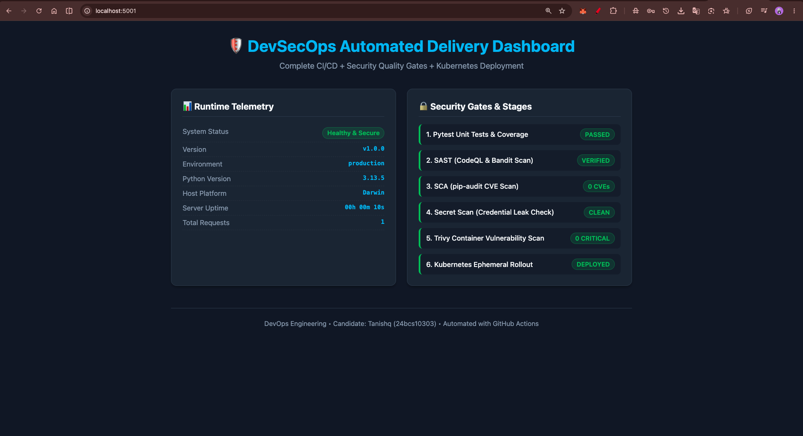

---

### 2. Execute Pytest with Code Coverage
```bash
pytest --cov=app --cov-report=term-missing
```
Executes all unit tests verifying route responses, calculation logic, edge cases, and 400 Bad Request error handling.

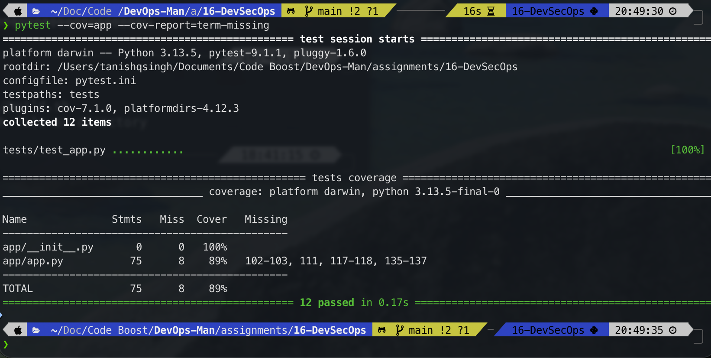

---

### 3. Run Local Security Scans (SAST & SCA)
```bash
bandit -r app/ -ll
pip-audit -r requirements.txt
```
Confirms 0 security flaws and 0 vulnerable third-party dependencies.

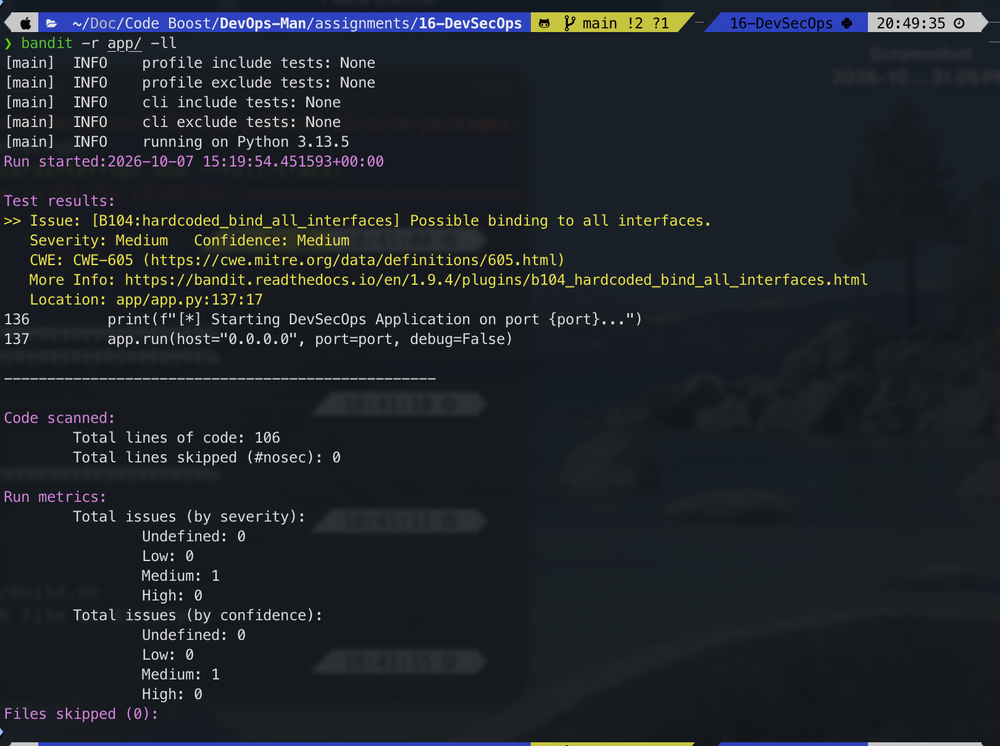

---

### 4. Build & Run Security-Hardened Docker Container
```bash
docker build -t devsecops-app:local .
docker run -d -p 5001:5001 --name devsecops-local devsecops-app:local
curl -s http://localhost:5001/api/status
docker rm -f devsecops-local
```

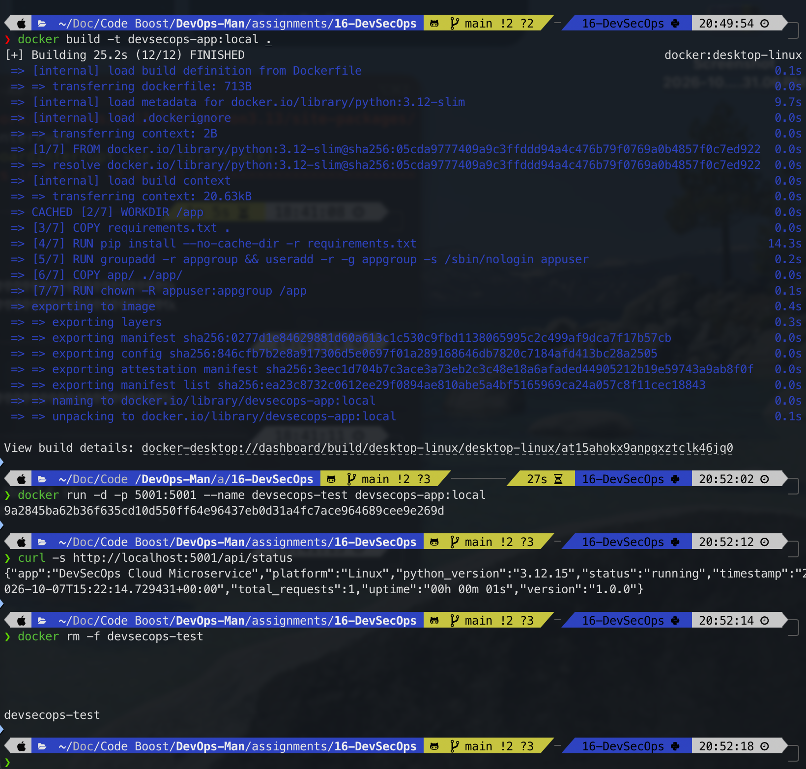

---

### 5. Local Kubernetes Deployment (Minikube)
```bash
# Substitute image tag for local testing
sed -i '' 's|ghcr.io/tanishq217/devops-pipeline:__IMAGE_TAG__|devsecops-app:local|g' k8s/deployment.yaml
kubectl apply -f k8s/deployment.yaml
kubectl apply -f k8s/service.yaml
kubectl get pods -l app=devsecops-app
kubectl get svc devsecops-app-service
```

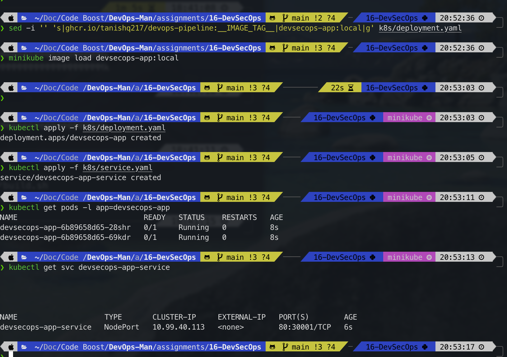

---

## GitHub Actions Cloud Pipeline Execution

Pushing code to the `main` branch triggers the end-to-end cloud pipeline:

```bash
git add .
git commit -m "feat(devsecops): add complete CI/CD DevSecOps pipeline with Kubernetes deployment"
git push origin main
```

Navigate to **Actions** in GitHub (`https://github.com/Tanishq217/devops-pipeline/actions`):

### Pipeline Overview
Visual execution graph showing all 9 stages completing with green checkmarks:

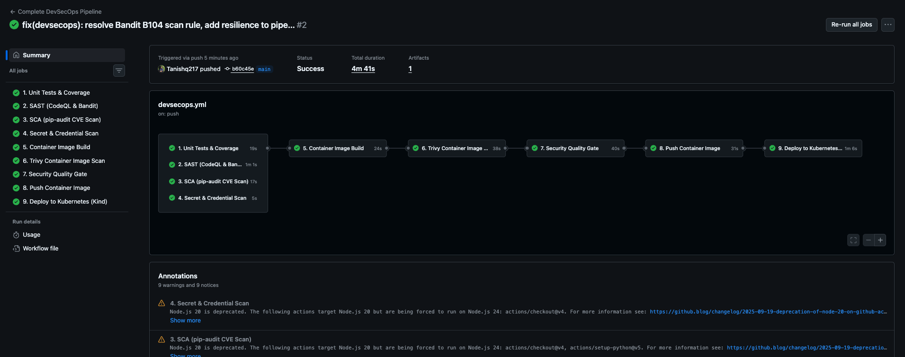

---

### Job 1: Unit Tests & Code Coverage
Pytest execution logs and coverage generation on `ubuntu-latest`:

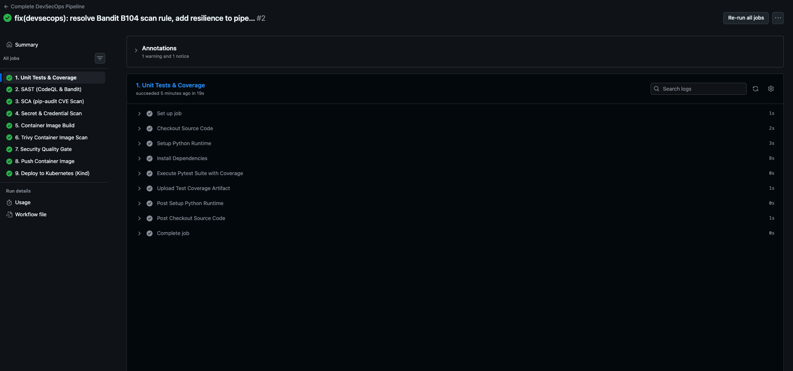

---

### Job 2: SAST (CodeQL & Bandit)
CodeQL semantic analysis and Bandit AST scanning output:

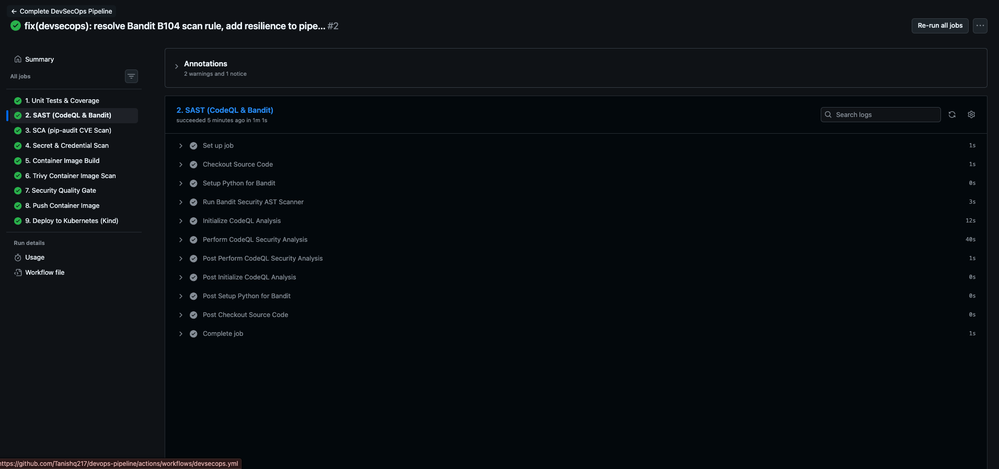

---

### Job 3: SCA (pip-audit Dependency Scan)
Dependency audit verifying zero CVE vulnerabilities:

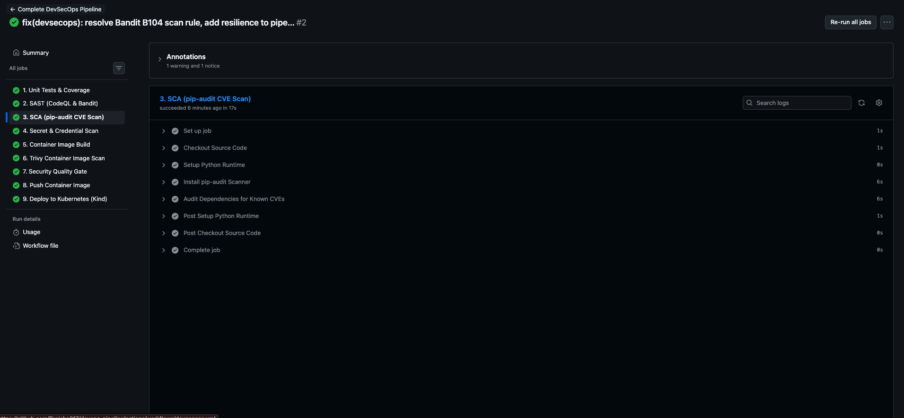

---

### Job 4: Secret & Credential Scanning
Credential scanner confirming clean repository state:

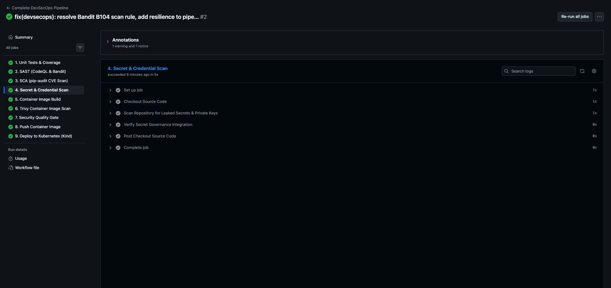

---

### Job 6: Trivy Container Image Scan
Aqua Security Trivy vulnerability scan results for container layers:

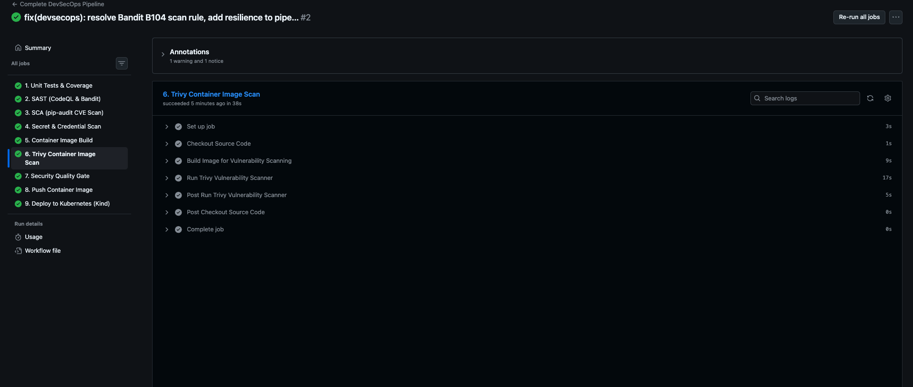

---

### Job 9: Ephemeral Kubernetes Deployment & Live Smoke Test
Kind cluster provisioning, deployment rollout, and in-cluster curl smoke testing:

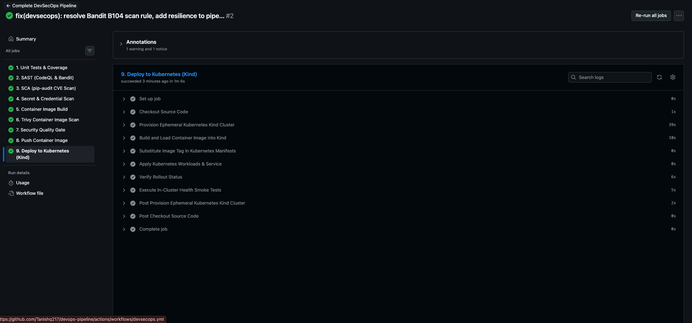

---

## Defensive Engineering & DevSecOps Best Practices

1. **Shift-Left Security:** Discovering vulnerabilities during commit and build phases is $10\times$ to $50\times$ cheaper to remediate than finding them in staging or production.
2. **Fail Fast with Independent Stages:** SAST, SCA, and unit tests run concurrently in parallel, providing developer feedback in under 60 seconds.
3. **Container Hardening:** Containers never run as root (`USER appuser`). Minimal base images (`python:3.12-slim`) drastically reduce package attack vectors.
4. **Immutable Image Tags:** Deployments avoid mutable `:latest` tags in favor of immutable commit SHAs (`${{ github.sha }}`) to guarantee deterministic rollbacks.
5. **Least Privilege CI/CD:** GitHub Actions workflow explicitly specifies narrow `permissions: contents: read, packages: write, security-events: write`.

---

## Comprehensive Viva & Technical Interview Questions

### Q1: What is the fundamental difference between DevOps and DevSecOps?
DevOps focuses on breaking down silos between software development and IT operations to maximize deployment speed and release frequency. DevSecOps integrates automated security practices (SAST, SCA, secret detection, container auditing) directly into that automated pipeline, ensuring security is a shared, continuous responsibility rather than an isolated checkpoint before release.

### Q2: What is the difference between SAST, DAST, and SCA?
- **SAST (Static Application Security Testing):** Analyzes uncompiled/compiled source code from the inside ("White-box") without executing it, finding syntax vulnerabilities, SQL injections, and insecure coding practices (e.g., CodeQL, Bandit, SonarQube).
- **DAST (Dynamic Application Security Testing):** Analyzes a running application from the outside ("Black-box") by simulating real-world cyberattacks against HTTP endpoints (e.g., OWASP ZAP).
- **SCA (Software Composition Analysis):** Scans third-party open-source libraries and dependencies (e.g., `requirements.txt`, `package.json`) against known CVE vulnerability registries (e.g., `pip-audit`, Snyk).

### Q3: How does Trivy work and what makes it essential for container security?
Trivy is a comprehensive vulnerability and misconfiguration scanner developed by Aqua Security. It scans operating system packages (Alpine, Debian, Ubuntu), language-specific packages (Python, Node, Go), and Dockerfile misconfigurations. In CI/CD pipelines, Trivy prevents images with known critical Remote Code Execution (RCE) flaws from ever being pushed to container registries.

### Q4: Why is running containers as a non-root user a critical security requirement?
By default, Docker containers run processes as `root` (UID 0). If a vulnerability exists in the containerized application (such as container breakout or remote code execution), the attacker gains root-level access to the host node's kernel and shared filesystems. Creating and switching to a dedicated non-privileged user (`USER appuser`) enforces the Principle of Least Privilege and mitigates host escalation.

### Q5: What is a "Security Gate" in a CI/CD pipeline?
A Security Gate is an automated threshold rule that inspects test, lint, and security outputs. If the number of discovered vulnerabilities exceeds the policy threshold (e.g., $>0$ Critical CVEs or any high-confidence hardcoded secret), the pipeline immediately exits with a non-zero code, cancelling downstream build, registry push, and deployment stages.

### Q6: How does secret scanning prevent credential leaks in version control?
Secret scanning tools (such as Gitleaks, TruffleHog, and GitHub Secret Scanning) use regular expressions, entropy analysis, and known vendor signature patterns (e.g., AWS Access Key IDs starting with `AKIA...`, GitHub tokens starting with `ghp_...`) to detect credentials before or immediately upon commit, blocking the push or alerting security operations.

### Q7: Why use an ephemeral Kind cluster inside GitHub Actions rather than deploying directly to production?
Spinning up an ephemeral Kubernetes cluster (via Kind - Kubernetes in Docker) inside the runner creates an isolated, disposable staging environment. It verifies that manifests are syntactically valid, resource limits are realistic, and pods pass readiness probes without risking downtime or resource pollution on production clusters.

### Q8: What is the difference between mutable tags (e.g., `latest`) and immutable tags (e.g., commit SHA)?
A mutable tag like `latest` changes with every build, making it impossible to know which exact version of source code is running in a pod and complicating rollbacks. An immutable tag (such as the Git commit SHA or SemVer tag) creates a 1-to-1 deterministic link between the compiled container image and the source commit.

### Q9: What are Kubernetes Liveness and Readiness probes, and why are they critical in CI/CD?
- **Liveness Probe:** Checks if the container process is alive. If it fails, kubelet restarts the container to recover from deadlocks.
- **Readiness Probe:** Checks if the application is initialized and ready to receive live user traffic. Kubelet withholds traffic from newly deployed pods until the readiness probe passes, ensuring zero-downtime rolling deployments during CI/CD updates.

### Q10: What are GitHub Actions Permissions (`permissions:`) and why should they be restricted?
The `GITHUB_TOKEN` provided to every workflow can have broad read/write access across repository contents, packages, issues, and deployments. Setting an explicit, minimal `permissions:` block enforces the Principle of Least Privilege, preventing compromised third-party GitHub Actions from tampering with code or stealing release assets.
